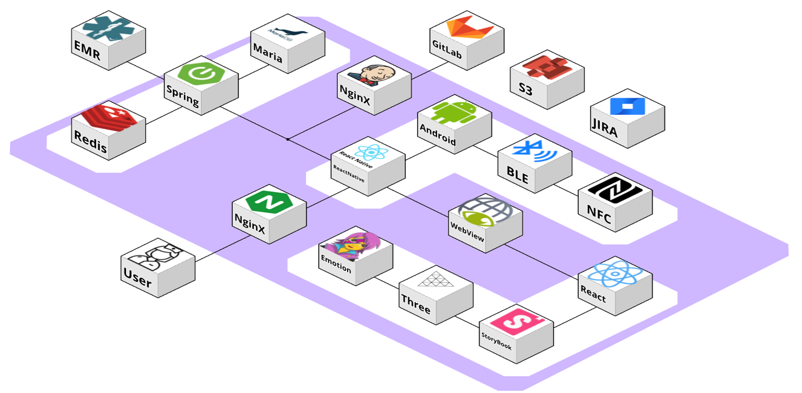

# 🏥BeNurse

> 병원 간호 업무의 효율성을 높이고, 간호사 간의 원활한 인수인계를 돕는 스마트 간호 관리 시스템
> 

<br>

## 📌 프로젝트 개요

- **프로젝트명**: BeNurse
- **개발기간**: 2023.10.09 ~ 2023.11.17 (6주)
- **팀원 구성**: 6명 (프론트엔드 3인, 백엔드 2인, 모바일&IoT 1인)
- **발표 자료**:  [구글 슬라이드 링크](https://docs.google.com/presentation/d/1zzPM9y1PS3GRZq6xtsMTXmn6HVGmRCz8X6Qd6xhsQ4I/edit?usp=sharing)
- **소개 UCC**: [YouTube 링크](https://youtu.be/kQ3KlyPVkUI?si=b-ND0RYEQ4e2tEEX)
- **성과**: 🏆SSAFY 9기 자율 프로젝트 우수상(2등)

<br>

## 🎯 프로젝트 배경

 사회적으로도 "태움"이라는 조직 내 언어폭력 문제가 대두되고 있으며, 이에 따라 **간호사 조직문화와 직무 스트레스에 대한 연구가 활발하게 진행**되고 있습니다. 특히, 3교대 간호사의 업무 강도는 상당하며 인수인계 과정에서 여러 문제가 발생했습니다.

 간호 현장에서는 **구두 인수인계**로 인해 환자 정보를 정확히 기억하지 못하는 경우 발생하고, **이동형 의료장비 관리 시스템 부재**로 수기로 장비 현황을 기록해 업무 비효율성이 증가하는 문제가 있습니다.

BeNurse는 이처럼 **구두 인수인계의 한계와 아날로그 방식의 의료장비 관리 문제를 해결하기 위해 개발된 스마트 간호 관리 시스템**입니다.

<br>

## ⚙️ 주요 기능 및 서비스 화면

### 📱모바일 앱

**1. 로그인 및 메인 화면**<br>
- 카카오 OAuth를 활용한 소셜 로그인
- 관리자가 생성한 등록 코드를 통해 간호사 인증
- 일정과 간호 팁을 확인할 수 있는 메인 화면
- 마이페이지

|    |    |    |    |
|:--------:|:--------:|:--------:|:--------:|
| 로그인 화면 | 등록 코드 화면 | 메인 화면 | 마이 페이지 |

**2. 인수인계 기능**
<br>
- 현재 근무 파트와 인계장 목록을 확인할 수 있는 메인 화면
- 인계 환자와 환자의 간호 일지에서 원하는 부분 불러오기
- 정해진 단계별로 인계장을 작성하고 인수자 선택
- 임시 저장 가능

|    |    |    |    |
|:--------:|:--------:|:--------:|:--------:|
| 인수인계 메인 | 인계장 작성 | 인수자 선택 | 인계장 확인 및 임시저장 |
    
**3. 스케쥴 확인 및 오프 신청**
<br>
- 월간 스케쥴과 일별 근무 간호사 확인
- 오프 신청 가능 (담당자 관리 페이지에서 신청 내역 확인 가능)

|    |    |    |
|:--------:|:--------:|:--------:|
| 월간 스케쥴 | 오프 신청 | 일별 근무 간호사 | 
    
**4. 환자 관리 기능**
<br>
- 병원 내부 네트워크로 접속 시에만 확인 가능
- 환자의 기본적인 정보와 간호 일지 확인/작성

|    |    |   |
|:--------:|:--------:|:--------:|
| 환자 목록 | 환자 상세 정보 | 간호 일지 작성 |

**5. 이동형 장비 관리**
<br>
- NFC와 BLE 비콘을 사용해 장비의 현재 위치 제공
- 장비의 사용 이력과 사용 현황 확인

|    |    |   |    |
|:--------:|:--------:|:--------:|:--------:|
| 장비 관리 메인 | 장비 목록 | 장비 위치 확인 | 장비 사용 이력 |

<br>

### 🖥️ PC 웹페이지 (관리자용)

**1. 로그인 및 메인 화면**<br>
- 병원 등록 및 간호사 가입
- 근무 일정 확인

|  |  |
|:--------:|:--------:|
| 로그인 페이지 | 병원 등록 및 간호사 가입 |

|  |  |
|:--------:|:--------:|
| 병원 등록 | 메인 페이지 |

<br>

**2. 근무표 작성 및 병원 관리**<br>
- 오프 신청 목록 확인
- 자체 알고리즘에 따라 지정된 오프를 포함해 근무표 자동 생성
- 병동, 간호사, 장비 관리

|  |  |
|:--------:|:--------:|
| 근무표 생성 | 병원 관리 |
    
<br>

## 🧑‍💻 개발 환경 및 기술 스택

### Management Tool
     

### Frontend
     

### Mobile & IoT
  

### Backend
      

### Infra
   

<br>

## 🚧 설계

### 시스템 아키텍처



```
📂 Backend
 ├─ 📂 BeNurse  # 실제 서비스
 │   └─ 📂 src
 │       └─ 📂 main
 │           ├─ 📂 java/com/ssafy
 │           │   ├─ 📂 Handover
 │           │   ├─ 📂 PatientWard
 │           │   ├─ 📂 Schedule
 │           │   ├─ 📂 common
 │           │   ├─ 📂 device
 │           │   ├─ 📂 emr
 │           │   ├─ 📂 hospital
 │           │   ├─ 📂 invite
 │           │   ├─ 📂 notice
 │           │   ├─ 📂 nurse
 │           │   ├─ 📂 oauth
 │           │   ├─ 📂 offschedule
 │           │   ├─ 📜 BeNurseApplication.java
 │	         │   │   ├─ 📂 AdminPage 📜 RequestDto.java
 │           └─ 📂 resources
 └─ 📂 BeNurse_EMR  # 병원 EMR (가상의 EMR)
```

```
📂 Frontend/BeNurse
 └─ 📂 src
    ├─ 📂 assets
    ├─ 📂 components
    │   ├─ 📂 atoms
    │   └─ 📂 templates
    ├─ 📂 libs
    ├─ 📂 navigations
    ├─ 📂 pages
    │   ├─ 📂 AdminPage
    │   ├─ 📂 DevicePage
    │   ├─ 📂 HandOverPage
    │   ├─ 📂 LoginPage
    │   ├─ 📂 MainPage
    │   ├─ 📂 MyPage
    │   ├─ 📂 NoticePage
    │   ├─ 📂 PatientPage
    │   ├─ 📂 ScheduleCreatePage
    │   └─ 📂 SchedulePage
    ├─ 📂 store
    ├─ 📂 utils
    ├─ 📜 App.css
    ├─ 📜 App.jsx
    ├─ 📜 index.css
    └─ 📜 main.jsx
```

```
📂 mobile
 ├─ 📂 nativepjk # 네이티브 기능 및 BLE, NFC 기능
 │   ├─ 📂 android
 │   ├─ 📂 components
 │   │   ├─ 📂 NFC
 │   │   ├─ 📂 bluetooth
 │   │   └─ 📂 native
 │   ├─ 📂 ios
 │   ├─ 📜 App.tsx
 │   └─ 📜 index.js
 └─ 📂 shift_work # 근무표 작성 알고리즘
```

### ERD


<br>

## **😎** 팀원 소개

| [김대웅](https://github.com/dang417) | [정소정](https://github.com/sojeong025) | [정은경](https://github.com/f1rstf1y9) | [성제현](https://github.com/protofu) | [이종윤](https://github.com/qjrm69) | [김성현](https://github.com/Sunghyun1320) |
| --- | --- | --- | --- | --- | --- |
|  |  |  |  |  |  |
| Frontend | Frontend | Frontend | Backend & CI/CD | Backend & CI/CD | Mobile & IoT |
